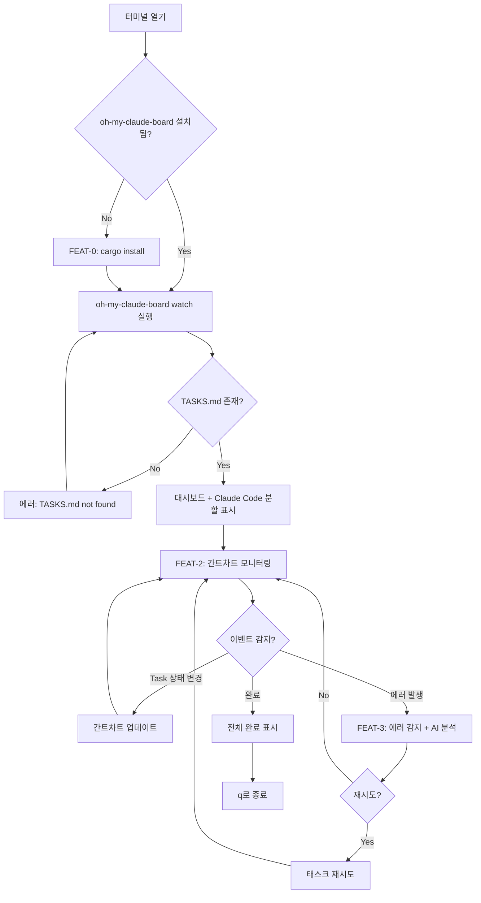
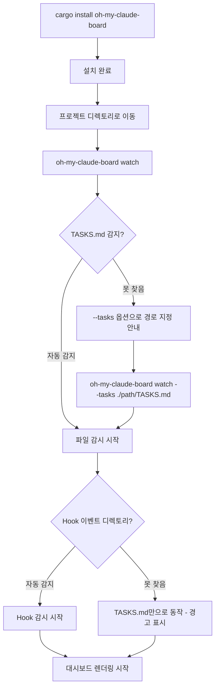
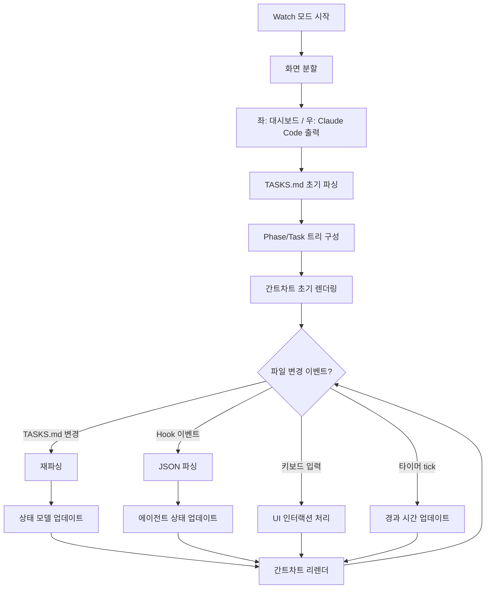
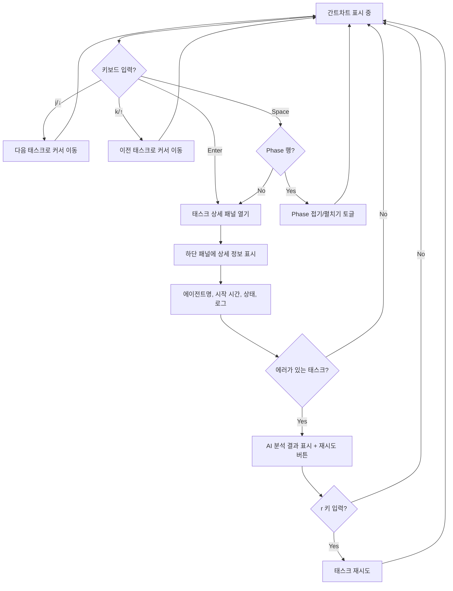
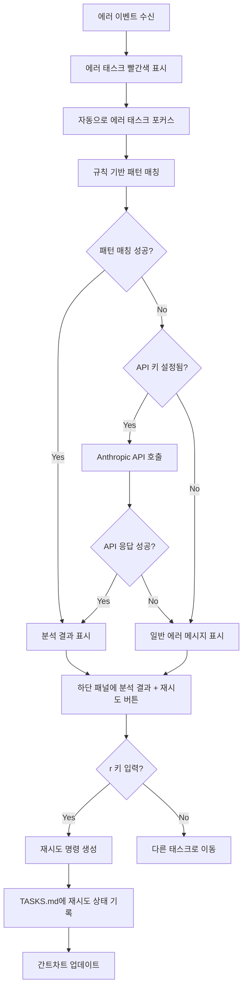
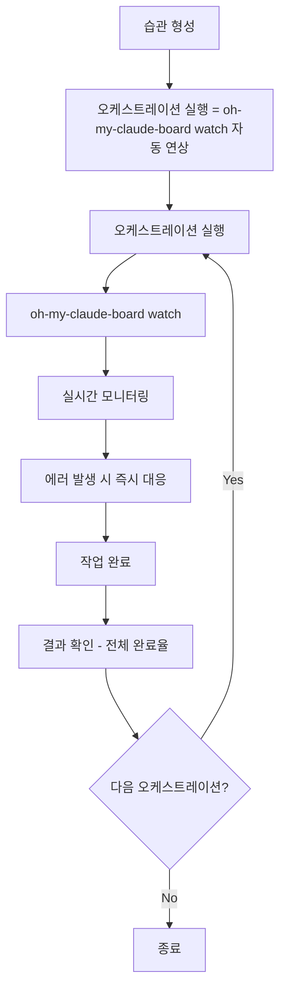
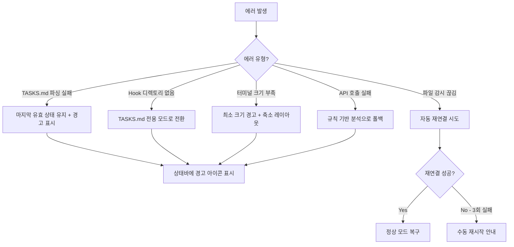

# User Flow (사용자 흐름도)

> oh-my-claude-board 대시보드의 핵심 사용자 여정

---

## MVP 캡슐

| # | 항목 | 내용 |
|---|------|------|
| 1 | 목표 | Claude Code 오케스트레이션 진행 상황을 터미널에서 실시간 시각화 |
| 2 | 페르소나 | Claude Code 헤비 유저 |
| 3 | 핵심 기능 | FEAT-1: Watch 모드, FEAT-2: 간트차트, FEAT-3: 에러 AI 분석 |
| 4 | 성공 지표 (노스스타) | GitHub Stars 100+ |
| 5 | 입력 지표 | 주간 다운로드 수, 이슈/PR 참여 수 |
| 6 | 비기능 요구 | 렌더링 60fps, 파일 변경 감지 < 500ms |
| 7 | Out-of-scope | Wrapper 모드, 비용 트래커, Slack 연동 |
| 8 | Top 리스크 | Rust 개발 속도 |
| 9 | 완화/실험 | 간트차트 프로토타입 먼저 구현 |
| 10 | 다음 단계 | Ratatui 프로토타입 구현 |

---

## 1. 전체 사용자 여정 (Overview)

---

## 2. FEAT-0: 설치 + 첫 실행 플로우

---

## 3. FEAT-1: Watch 모드 모니터링 플로우

---

## 4. FEAT-2: 간트차트 인터랙션 플로우

---

## 5. FEAT-3: 에러 감지 + AI 분석 플로우

---

## 6. 화면 목록 (Screen Inventory)

| 화면 ID | 화면명 | FEAT | 진입점 | 주요 액션 |
|---------|--------|------|--------|----------|
| S-01 | 대시보드 (메인) | ALL | oh-my-claude-board watch | 간트차트 + 상세 + Claude 출력 |
| S-02 | 간트차트 패널 | FEAT-2 | S-01 좌측 상단 | Phase/Task 트리 탐색 |
| S-03 | 태스크 상세 패널 | FEAT-2 | S-02에서 Enter | 에이전트/로그/에러 확인 |
| S-04 | 에러 분석 뷰 | FEAT-3 | S-03 (에러 태스크) | AI 분석 확인 + 재시도 |
| S-05 | Claude Code 출력 | FEAT-1 | S-01 우측 | 실행 로그 스크롤 |
| S-06 | 도움말 오버레이 | - | ? 키 입력 | 키바인딩 확인 |
| S-07 | 에러 화면 | - | TASKS.md 미발견 | 경로 지정 안내 |

---

## 7. 리텐션 루프

> TUI 대시보드의 리텐션은 "오케스트레이션을 실행할 때마다 자연스럽게 함께 사용"하는 습관 형성에 있다. 별도의 푸시 알림이나 리마인더가 필요 없으며, 도구 자체의 유용성이 리텐션을 만든다.

---

## 8. 에러 처리 플로우

---

## Decision Log

| # | 결정 | 근거 |
|---|------|------|
| D1 | 설치 후 Zero-config 작동 | 진입 장벽 최소화, TASKS.md 자동 감지 |
| D2 | 에러 시 자동 포커스 | 에러 인지 시간 최소화 |
| D3 | 파싱 실패 시 마지막 유효 상태 유지 | 일시적 파일 변경으로 인한 깜빡임 방지 |
| D4 | vim 스타일 키바인딩 (j/k) | 타겟 사용자(개발자)의 터미널 사용 습관 |
