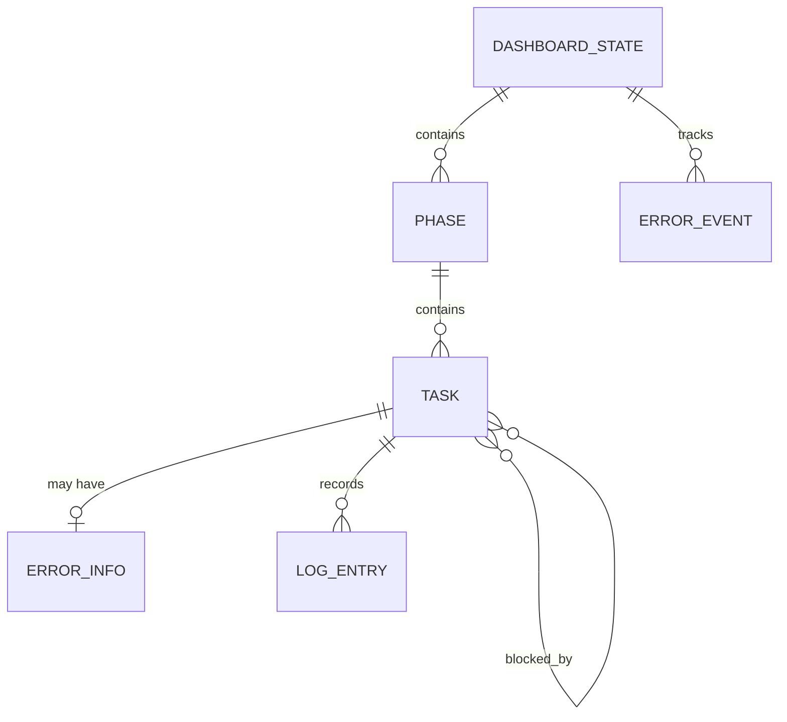

# Data Model Design (데이터 모델 설계)

> oh-my-claude-board는 데이터베이스 없이 파일 기반으로 동작하는 TUI 앱입니다.
> 이 문서는 전통적 DB ERD 대신, 인메모리 상태 모델과 데이터 소스를 정의합니다.

---

## MVP 캡슐

| # | 항목 | 내용 |
|---|------|------|
| 1 | 목표 | Claude Code 오케스트레이션 진행 상황을 터미널에서 실시간 시각화 |
| 2 | 페르소나 | Claude Code 헤비 유저 |
| 3 | 핵심 기능 | FEAT-1: Watch 모드, FEAT-2: 간트차트, FEAT-3: 에러 AI 분석 |
| 4 | 성공 지표 (노스스타) | GitHub Stars 100+ |
| 5 | 입력 지표 | 주간 다운로드 수 |
| 6 | 비기능 요구 | 렌더링 60fps, 파일 변경 감지 < 500ms |
| 7 | Out-of-scope | Wrapper 모드, 비용 트래커, Slack 연동, 영구 저장소 |
| 8 | Top 리스크 | Rust 개발 속도 |
| 9 | 완화/실험 | 파서 프로토타입 먼저 구현 |
| 10 | 다음 단계 | TASKS.md 파서 구현 |

---

## 1. 데이터 아키텍처 개요

```
┌──────────────────────────────────────────────────────────┐
│                    External Data Sources                   │
├────────────────────────┬─────────────────────────────────┤
│     TASKS.md (File)    │     Hook Events (JSON Files)    │
│  ┌──────────────────┐  │  ┌─────────────────────────┐    │
│  │ Phase/Task 구조  │  │  │ agent_start/end events  │    │
│  │ 상태 (✅/🔄/❌)  │  │  │ tool_start/end events   │    │
│  │ 의존성 관계     │  │  │ error events            │    │
│  │ 에이전트 할당    │  │  │ timestamps              │    │
│  └──────────────────┘  │  └─────────────────────────┘    │
└────────────┬───────────┴──────────────┬──────────────────┘
             │                          │
             ▼                          ▼
┌────────────────────────────────────────────────────────────┐
│                   In-Memory State Model                      │
│  ┌──────────────────────────────────────────────────────┐  │
│  │  DashboardState                                       │  │
│  │  ├── phases: Vec<Phase>                               │  │
│  │  │   ├── id, name, status, progress                   │  │
│  │  │   └── tasks: Vec<Task>                             │  │
│  │  │       ├── id, name, status, agent                  │  │
│  │  │       ├── started_at, completed_at                 │  │
│  │  │       ├── logs: Vec<LogEntry>                      │  │
│  │  │       ├── error: Option<ErrorInfo>                 │  │
│  │  │       └── blocked_by: Vec<TaskId>                  │  │
│  │  ├── selected_task: Option<TaskId>                    │  │
│  │  ├── errors: Vec<ErrorEvent>                          │  │
│  │  └── metadata: SessionMetadata                        │  │
│  └──────────────────────────────────────────────────────┘  │
└────────────────────────────────────────────────────────────┘
```

---

## 2. 엔티티 정의 (In-Memory)

### 2.1 DashboardState (루트)

| 필드 | 타입 | 설명 |
|------|------|------|
| phases | Vec\<Phase\> | 전체 Phase 목록 |
| selected_task | Option\<TaskId\> | 현재 선택된 태스크 |
| errors | Vec\<ErrorEvent\> | 에러 이벤트 히스토리 |
| metadata | SessionMetadata | 세션 메타데이터 |
| last_updated | Instant | 마지막 상태 업데이트 시간 |

### 2.2 Phase

| 필드 | 타입 | 설명 |
|------|------|------|
| id | String | Phase 식별자 (예: "phase-1") |
| name | String | Phase 이름 (예: "기반 설정") |
| status | PhaseStatus | Pending / InProgress / Completed / Failed |
| progress | f32 | 완료율 0.0 ~ 1.0 |
| tasks | Vec\<Task\> | 소속 태스크 목록 |
| collapsed | bool | UI에서 접힘 상태 |

**PhaseStatus 전이:**
```
Pending ──▶ InProgress ──▶ Completed
                │
                └──▶ Failed (하위 태스크 실패 시)
```

### 2.3 Task

| 필드 | 타입 | 설명 |
|------|------|------|
| id | String | 태스크 식별자 (예: "T1.1") |
| name | String | 태스크 이름 |
| status | TaskStatus | Pending / InProgress / Completed / Failed / Blocked |
| agent | Option\<String\> | 할당된 에이전트 이름 |
| started_at | Option\<DateTime\> | 시작 시간 |
| completed_at | Option\<DateTime\> | 완료 시간 |
| duration | Option\<Duration\> | 소요 시간 (계산) |
| logs | Vec\<LogEntry\> | 실행 로그 |
| error | Option\<ErrorInfo\> | 에러 정보 |
| blocked_by | Vec\<String\> | 의존하는 태스크 ID 목록 |

**TaskStatus 전이:**
```
Pending ──▶ Blocked (의존성 미완료)
   │            │
   │            ▼
   └──▶ InProgress ──▶ Completed
              │
              └──▶ Failed ──▶ InProgress (재시도)
```

### 2.4 ErrorInfo

| 필드 | 타입 | 설명 |
|------|------|------|
| message | String | 에러 메시지 원본 |
| category | ErrorCategory | Type / Runtime / Network / Permission / Unknown |
| analysis | String | 규칙 기반/AI 분석 결과 |
| retryable | bool | 재시도 가능 여부 |
| occurred_at | DateTime | 에러 발생 시간 |
| source | ErrorSource | TasksMd / HookEvent |

### 2.5 LogEntry

| 필드 | 타입 | 설명 |
|------|------|------|
| timestamp | DateTime | 로그 시간 |
| level | LogLevel | Info / Warn / Error |
| message | String | 로그 메시지 |
| source | String | 출처 (에이전트명 또는 시스템) |

### 2.6 SessionMetadata

| 필드 | 타입 | 설명 |
|------|------|------|
| tasks_md_path | PathBuf | TASKS.md 파일 경로 |
| hooks_dir | Option\<PathBuf\> | Hook 이벤트 디렉토리 |
| started_at | DateTime | 세션 시작 시간 |
| total_tasks | usize | 전체 태스크 수 |
| completed_tasks | usize | 완료된 태스크 수 |
| failed_tasks | usize | 실패한 태스크 수 |

---

## 3. 관계 정의



| 부모 | 자식 | 관계 | 설명 |
|------|------|------|------|
| DashboardState | Phase | 1:N | 대시보드는 여러 Phase 포함 |
| Phase | Task | 1:N | Phase는 여러 Task 포함 |
| Task | ErrorInfo | 1:0..1 | Task는 에러 정보 0~1개 |
| Task | LogEntry | 1:N | Task는 여러 로그 기록 |
| Task | Task | N:N | Task 간 의존성 (blocked_by) |

---

## 4. 데이터 소스 파싱 스키마

### 4.1 TASKS.md 파싱 규칙

```markdown
# TASKS.md 예시 구조

## Phase 1: 기반 설정
### T1.1 프로젝트 초기화 [completed] @backend-specialist
### T1.2 DB 스키마 설계 [completed] @database-specialist
  - blocked_by: T1.1

## Phase 2: 핵심 기능
### T2.1 API 엔드포인트 [in_progress] @backend-specialist
### T2.2 프론트엔드 컴포넌트 [pending]
  - blocked_by: T2.1
### T2.3 통합 테스트 [pending]
  - blocked_by: T2.1, T2.2
```

**파싱 매핑:**

| 마크다운 요소 | 상태 모델 필드 | 파싱 규칙 |
|-------------|-------------|----------|
| `## Phase N:` | Phase.id, Phase.name | H2 헤딩에서 추출 |
| `### TN.M` | Task.id, Task.name | H3 헤딩에서 추출 |
| `[completed]` | Task.status = Completed | 대괄호 내 상태 문자열 |
| `[in_progress]` | Task.status = InProgress | 대괄호 내 상태 문자열 |
| `[pending]` | Task.status = Pending | 대괄호 내 상태 문자열 |
| `[failed]` | Task.status = Failed | 대괄호 내 상태 문자열 |
| `@agent-name` | Task.agent | @ 접두사 에이전트명 |
| `blocked_by: T1.1` | Task.blocked_by | 의존성 목록 |

### 4.2 Hook 이벤트 JSON 스키마

```json
{
  "type": "agent_start",
  "timestamp": "2026-02-08T14:23:05.123Z",
  "data": {
    "agent_id": "backend-specialist",
    "task_id": "T2.1",
    "session_id": "abc123"
  }
}
```

| 이벤트 타입 | 상태 모델 반영 |
|------------|-------------|
| agent_start | Task.agent 설정, Task.started_at 기록 |
| agent_end | Task.completed_at 기록 |
| tool_start | LogEntry 추가 |
| tool_end | LogEntry 추가 |
| error | ErrorInfo 생성, Task.status = Failed |

---

## 5. 데이터 생명주기

| 데이터 | 생성 시점 | 소멸 시점 | 영구 저장 |
|--------|----------|----------|----------|
| DashboardState | 앱 시작 | 앱 종료 | ❌ 인메모리 |
| Phase/Task | TASKS.md 첫 파싱 | 앱 종료 | ❌ 인메모리 |
| LogEntry | Hook 이벤트 수신 | 앱 종료 | ❌ 인메모리 |
| ErrorInfo | 에러 감지 | 앱 종료 | ❌ 인메모리 |

> oh-my-claude-board는 상태를 영구 저장하지 않습니다. 모든 데이터는 TASKS.md와 Hook 이벤트 파일에서 재구성 가능합니다.

---

## 6. 확장 고려사항

### 6.1 v2에서 추가 예정

| 데이터 | 용도 | 저장 방식 |
|--------|------|----------|
| CostEntry | 토큰 사용량/비용 추적 | 인메모리 (API 응답 기반) |
| NotificationLog | Slack 알림 이력 | 인메모리 |
| SessionHistory | 이전 세션 통계 | JSON 파일 (선택적) |

### 6.2 데이터 일관성 규칙

| 규칙 | 설명 |
|------|------|
| TASKS.md 우선 | 상태 충돌 시 TASKS.md가 원본 |
| 이벤트 순서 | timestamp 기반 정렬 |
| 중복 이벤트 | event_id 기반 중복 제거 |
| 파싱 실패 | 마지막 유효 상태 유지 |

---

## Decision Log

| # | 결정 | 근거 |
|---|------|------|
| D1 | DB 없이 인메모리 | TUI 앱이므로 영구 저장 불필요, 모든 원본은 파일 |
| D2 | TASKS.md 상태 우선 | 오케스트레이터가 직접 관리하는 원본 데이터 |
| D3 | 파싱 실패 시 폴백 | 파일 변경 중간 상태 읽기 방지 |
