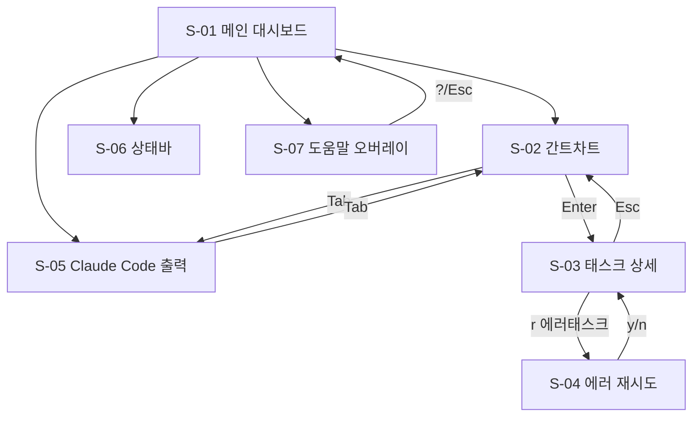

# 화면 명세 (06-screens.md)

> oh-my-claude-board TUI 대시보드의 화면 목록, 구성 요소, 연결 관계를 정의합니다.
> /screen-spec 스킬의 입력으로 사용됩니다.

---

## 개요

| 항목 | 내용 |
|------|------|
| **서비스명** | oh-my-claude-board |
| **핵심 기능** | FEAT-1: Watch 모드, FEAT-2: 간트차트, FEAT-3: 에러 AI 분석 |
| **총 화면 수** | 7개 (메인 + 6 서브 패널/오버레이) |
| **인증 필요 화면** | 0개 (로컬 CLI 도구) |

---

## 화면 목록

### 1. 메인 대시보드 (S-01)

| 항목 | 내용 |
|------|------|
| **화면 ID** | S-01 |
| **연결 기능** | ALL |
| **인증 필요** | No |
| **진입점** | `oh-my-claude-board watch` 실행 |

**주요 요소:**
- **좌측 패널**: 간트차트 (S-02) + 태스크 상세 (S-03) 수직 분할
- **우측 패널**: Claude Code 출력 (S-05)
- **하단 상태바**: (S-06) 전체 진행률 + 태스크 요약 + 경과 시간

**사용자 액션:**
- `Tab` → 좌/우 패널 포커스 전환
- `q` → 앱 종료
- `?` → 도움말 오버레이 (S-07) 표시

**레이아웃:**
```
┌─────────── S-01 메인 대시보드 ──────────────────────────┐
│ ┌─ S-02 간트차트 ──────┐ ┌─ S-05 Claude Code ────────┐ │
│ │                      │ │                            │ │
│ │                      │ │                            │ │
│ │                      │ │                            │ │
│ ├─ S-03 태스크 상세 ───┤ │                            │ │
│ │                      │ │                            │ │
│ └──────────────────────┘ └────────────────────────────┘ │
│ ┌─ S-06 상태바 ────────────────────────────────────────┐ │
│ └──────────────────────────────────────────────────────┘ │
└─────────────────────────────────────────────────────────┘
```

---

### 2. 간트차트 패널 (S-02)

| 항목 | 내용 |
|------|------|
| **화면 ID** | S-02 |
| **연결 기능** | FEAT-2 |
| **인증 필요** | No |
| **진입점** | S-01 좌측 상단 (기본 포커스) |

**주요 요소:**
- **Phase 행**: 접이식 (▼/▶), Phase 이름, 진행률 프로그레스바, 상태 심볼
- **Task 행**: 트리 커넥터 (├/└), Task 이름, 진행률, 상태 심볼, 에이전트명
- **커서 하이라이트**: Cyan 배경으로 현재 선택 행 표시
- **스크롤 인디케이터**: 태스크가 화면을 초과하면 상/하단에 화살표

**사용자 액션:**
- `j/↓` → 다음 행으로 이동
- `k/↑` → 이전 행으로 이동
- `Space` → Phase 접기/펼치기 (Phase 행에서만)
- `Enter` → 선택된 태스크 상세 보기 (S-03 업데이트)
- `g` → 맨 위로 이동
- `G` → 맨 아래로 이동

**이동 가능 화면:**
- → S-03 (Enter 키: 태스크 상세 패널 업데이트)
- → S-05 (Tab 키: Claude Code 출력으로 포커스 이동)

---

### 3. 태스크 상세 패널 (S-03)

| 항목 | 내용 |
|------|------|
| **화면 ID** | S-03 |
| **연결 기능** | FEAT-2, FEAT-3 |
| **인증 필요** | No |
| **진입점** | S-02에서 태스크 선택 (Enter) |

**주요 요소:**
- **태스크 헤더**: Task ID + 이름 + 상태 심볼
- **메타데이터**: 에이전트명, 시작 시간, 경과 시간, 진행률
- **로그 영역**: 최근 실행 로그 (스크롤 가능)
- **에러 영역** (에러 태스크만): 에러 메시지 + AI 분석 결과 + 재시도 안내

**사용자 액션:**
- (일반 태스크) 스크롤로 로그 확인
- (에러 태스크) `r` → 태스크 재시도 (S-04 동작 트리거)
- `Esc` → 간트차트(S-02)로 포커스 복귀

**이동 가능 화면:**
- → S-04 (r 키: 에러 태스크 재시도)
- → S-02 (Esc 키: 간트차트로 복귀)

---

### 4. 에러 분석 + 재시도 (S-04)

| 항목 | 내용 |
|------|------|
| **화면 ID** | S-04 |
| **연결 기능** | FEAT-3 |
| **인증 필요** | No |
| **진입점** | S-03에서 r 키 입력 (에러 태스크) |

**주요 요소:**
- **확인 프롬프트**: "Task {ID}를 재시도하시겠습니까? [y/n]"
- **재시도 진행 표시**: 스피너 + "재시도 중..."
- **결과 표시**: 성공/실패 메시지

**사용자 액션:**
- `y` → 재시도 실행
- `n` → 취소, S-03으로 복귀

**이동 가능 화면:**
- → S-03 (재시도 완료/취소 후)
- → S-02 (간트차트 상태 자동 업데이트)

---

### 5. Claude Code 출력 패널 (S-05)

| 항목 | 내용 |
|------|------|
| **화면 ID** | S-05 |
| **연결 기능** | FEAT-1 |
| **인증 필요** | No |
| **진입점** | S-01 우측 (Tab 키로 포커스 전환) |

**주요 요소:**
- **출력 영역**: Claude Code의 stdout/stderr 실시간 표시
- **자동 스크롤**: 새 출력이 들어오면 자동으로 하단으로 스크롤
- **스크롤 잠금**: 사용자가 위로 스크롤하면 자동 스크롤 일시 중지

**사용자 액션:**
- `j/↓` → 아래로 스크롤
- `k/↑` → 위로 스크롤
- `f` → 자동 스크롤 토글 (Follow mode)
- `Tab` → 좌측 대시보드로 포커스 이동

**이동 가능 화면:**
- → S-02 (Tab 키: 간트차트로 포커스)

---

### 6. 상태바 (S-06)

| 항목 | 내용 |
|------|------|
| **화면 ID** | S-06 |
| **연결 기능** | ALL |
| **인증 필요** | No |
| **진입점** | 항상 표시 (1행 고정) |

**주요 요소:**
- **진행률**: `[67%] 8/12 tasks`
- **상태 카운터**: `✔6 ◀2 ✘1 ⊘3`
- **경과 시간**: `uptime: 00:45:12`
- **도움말 힌트**: `?:help`
- **경고 아이콘**: 파일 감시 에러 시 `⚠` 표시

**사용자 액션:**
- 상호작용 없음 (정보 표시 전용)

---

### 7. 도움말 오버레이 (S-07)

| 항목 | 내용 |
|------|------|
| **화면 ID** | S-07 |
| **연결 기능** | - |
| **인증 필요** | No |
| **진입점** | `?` 키 입력 |

**주요 요소:**
- **키바인딩 목록**: 모든 키보드 단축키 표시
- **버전 정보**: oh-my-claude-board 버전
- **종료 안내**: "Press ? or Esc to close"

**사용자 액션:**
- `?` 또는 `Esc` → 오버레이 닫기

**이동 가능 화면:**
- → 이전 화면 (오버레이 닫기)

---

## 화면 흐름도



---

## 화면 연결 매트릭스

| From \ To | S-01 | S-02 | S-03 | S-04 | S-05 | S-06 | S-07 |
|-----------|------|------|------|------|------|------|------|
| **S-01** | - | auto | - | - | auto | auto | ? |
| **S-02** | - | - | Enter | - | Tab | - | ? |
| **S-03** | - | Esc | - | r | - | - | ? |
| **S-04** | - | - | y/n | - | - | - | - |
| **S-05** | - | Tab | - | - | - | - | ? |
| **S-06** | - | - | - | - | - | - | - |
| **S-07** | ?/Esc | - | - | - | - | - | - |

---

## 공통 요소

### 패널 테두리
- 활성 패널: `Style::default().fg(Color::White)` + 패널 제목 Bold
- 비활성 패널: `Style::default().fg(Color::DarkGray)` + 패널 제목 Dim

### 키보드 단축키 (전역)
- `q`: 앱 종료
- `?`: 도움말 오버레이 토글
- `Tab`: 패널 간 포커스 전환

---

## 빈 상태 (Empty States)

| 화면 | 빈 상태 메시지 | 액션 |
|------|---------------|------|
| 간트차트 | "TASKS.md를 감지하지 못했습니다" | "--tasks 옵션으로 경로를 지정하세요" |
| 태스크 상세 | "태스크를 선택하세요 (j/k로 이동, Enter로 선택)" | - |
| Claude 출력 | "Claude Code 출력 대기 중..." | - |
| 로그 영역 | "아직 로그가 없습니다" | - |

---

## 에러 상태

| 에러 유형 | 표시 방식 | 사용자 액션 |
|----------|----------|------------|
| TASKS.md 미발견 | 전체 화면 에러 메시지 | 경로 지정 후 재실행 |
| TASKS.md 파싱 실패 | 상태바 ⚠ + 마지막 유효 상태 유지 | 자동 복구 대기 |
| Hook 디렉토리 없음 | 상태바 경고 + TASKS.md 전용 모드 | 정상 동작 (기능 축소) |
| 파일 감시 끊김 | 상태바 ⚠ + 자동 재연결 | 3회 실패 시 재시작 안내 |
| API 호출 실패 | 규칙 기반 분석으로 폴백 | 정상 동작 (기능 축소) |

---

## 다음 단계

이 문서를 기반으로:

1. **`/screen-spec`** 실행 → 각 화면별 상세 YAML 명세 생성
2. **`/tasks-generator`** 실행 → 화면 단위 태스크 생성

```
06-screens.md (이 문서)
    ↓
/screen-spec
    ↓
specs/screens/*.yaml
    ↓
/tasks-generator
    ↓
TASKS.md
```
